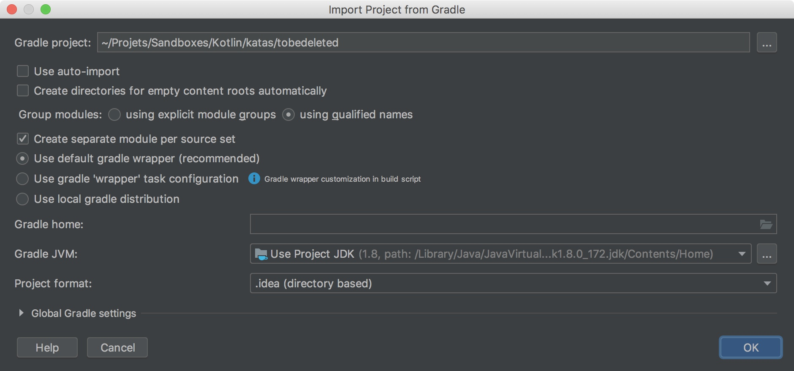

# Kotlin kata starter

A simple Kotlin setup for kata practice

## Summary
* [Dependencies](#dependencies)
* [Import with IntelliJ](#import-with-intellij)
* [Automate it!](#automate-it)

## Dependencies
* JUnit 5
* KotlinTest

## Import with intelliJ
**1 - Once cloned just click "Open" within the Intellij wizard**


**2 - Configure import as show below**


## Automate it !
**1 - Create a clone script**

This script:
- Takes as first argument the name of the projet you want to create (*i.e. diamond* for the diamond kata)
- Creates a folder with that name in the current directory
- Clones the kotlin-kata-starter repository
- Erases the `.git` folder so you can set your own if you wish

kotlin-kata-starter.sh
```bash
#!/bin/bash

set -euo pipefail
IFS=$'\n\t'

RED=$(tput setaf 1)
GREEN=$(tput setaf 2)
NORMAL=$(tput sgr0)

die () {
    echo >&2 "$@"
    exit 1
}

[ "$#" -gt 0 ] || die "${RED} ❌   Kata name required as first argument, none provided.${NORMAL}"

readonly kataName=${1:-}

git clone git@github.com:EGI-OCTO/kotlin-kata-starter.git ./$kataName

rm -rf ./$kataName/.git

echo "${GREEN}✅   - Kata project created, test your configuration by running \"./gradlew clean test\"${NORMAL} (or use your own wrapper \"gradle wrapper\")"
```

**2 - Set it as an alias**
```bash
kataKotlin='sh ~/kotlin-kata-starter.sh'
```

**3 - Use it !**
```bash
kataKotlin diamond
```
